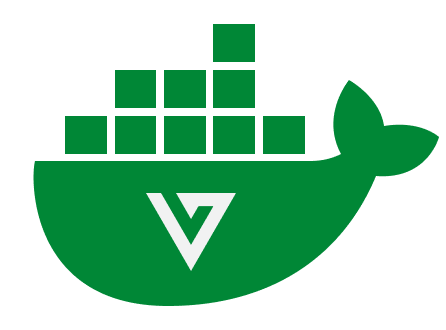

# alt:V server Docker image
#### Docker image to easily deploy your alt:V server 
**[Docker Hub &nearr;](https://hub.docker.com/r/altmp/altv-server)** • **[Got an issue?](https://github.com/altmp/altv-docker/issues/new)**
<br><br>
[](https://discord.altv.mp/)
[](https://go.altv.mp/patreon/)
[](https://altv.mp/)
<br/>

> **Warning**<br/>This image is available for versions starting from alt:V 15, which is currently under development and not available for productive use. Until the final alt:V 15 release this image will be only available for the `dev` branch. For productive use see the [unofficial image &nearr;](https://github.com/eisengrind/docker-altv-server) meanwhile.

## Usage

To start a minimal release server run:
```bash
docker run --rm -it -p 7788:7788 -p 7788:7788/udp altmp/altv-server:release
```

## Configuration

The alt:V server is located at the path `/altv` inside the Docker container.

### Server settings

There are two ways to specify server configurations:

#### Configuration via environment variables

This image allows you to set all existing server settings by specifying environment variables.
All variables follow the syntax `ALTV_SETTING_NAME`, for a complete list of options look at the [setup script](config/index.js#L80).

In case of array values (`arr('...')`) specify a comma separated string.<br>
In case of boolean values (`bool('...')`) specify `true`, `yes`, `y` or `1` for true, or `false`, `no`, `n`, or `0` for false.<br>
In case of JSON values (`jsonObj('...')`) specify a valid JSON object

Example:
```bash
docker run --rm -it \
    -p 7788:7788 -p 7788:7788/udp \
    -e ALTV_PLAYERS=100 -e ALTV_DEBUG=true \
    altmp/altv-server:release
```

#### Configuration via volumes

You can provide your own `server.toml` to configure your server.
To do this, mount the file to `/altv/server.toml` and specify the environment variable `ALTV_USE_ENV_CONFIG=false`.

Example:
```bash
docker run --rm -it \
    -p 7788:7788 -p 7788:7788/udp \
    -v ./server.toml:/altv/server.toml \
    -e ALTV_USE_ENV_CONFIG=false \
    altmp/altv-server:release
```

### Arguments

Arguments of the Docker image get passed directly to `altv-server`.
See [CLI arguments &nearr;](https://go.altv.mp/server-cli) for more info.

Example:
```bash
docker run --rm -it \
    -p 7788:7788 -p 7788:7788/udp \
    altmp/altv-server:release \
    --convert-config-format
```

## Resources

If server is configured using environment variables by default the Docker image loads all resources located in `/altv/resources`.
You can override this behavior by specifying custom resources array via configuration.

Example:
```bash
docker run --rm -it \
    -p 7788:7788 -p 7788:7788/udp \
    -v ./resources:/altv/resources \
    -e ALTV_RESOURCES=resource1,resource2 \
    altmp/altv-server:release
```

## Modules

By default, this image includes [JS Module &nearr;](https://github.com/altmp/altv-js-module) and [C# Module &nearr;](https://github.com/altmp/coreclr-module) on all branches.
On `release` branch this image also includes [JS Bytecode Module &nearr;](https://github.com/altmp/altv-js-bytecode).<br>
To load custom modules add them to `/altv/modules`, and specify custom modules array via configuration.

Example:
```bash
docker run --rm -it \
    -p 7788:7788 -p 7788:7788/udp \
    -v ./my-module.so:/altv/modules/my-module.so \
    -e ALTV_MODULES=js-module,csharp-module,my-module \
    altmp/altv-server:release
```


## Usage as a base image

In a lot of cases it will be much more convinient to create your own Dockerfile, that is using this image as a base. This way you can modify every part of the server, include your resources, setup configuration, etc.

Example:
```dockerfile
FROM altmp/altv-server:release

ENV ALTV_NAME="My cool server"
ENV ALTV_DEBUG=true

COPY my-cool-resource /altv/resources/my-cool-resource
```

## Special thanks

Special thanks to @pixlcrashr at @eisengrind who created and has been maintaining the [unofficial alt:V server Docker image &nearr;](https://github.com/eisengrind/docker-altv-server).

## License

See [LICENSE](LICENSE) for more information.